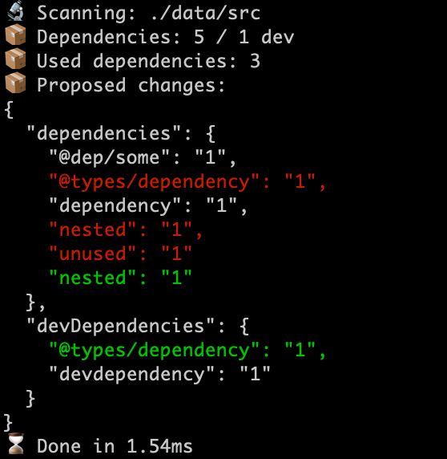

# 🔬 depcheck-quick

Status: (work in progress - v0.0.5)

**⚡ Searches for unused npm dependencies in javascript projects, quickly.**



## Install and build 

`cargo build --release`

Then use the executable:
`./target/release/depcheck-quick --help`

## Usage

Basic usage:
```bash
$ depcheck-quick --root .
```

Or, for available options:
```bash
$ depcheck-quick --help
```


## Conformance
`depcheck-quick` is not fully featured, `depcheck` can do more and is more accurate.

It does not use an es module parser, it instead uses multiple term search using [Double-Array Aho-Corasick](https://github.com/daac-tools/daachorse).
It does not check for missing dependencies. 
It only supports: "tsx", "ts", "jsx", "js", "mjs", "cjs" extension searching.

## Performance

Benchmarks were done using [Hyperfine](https://github.com/sharkdp/hyperfine").

Running on the [react](https://github.com/facebook/react) (~1900 js files) repo with a custom set of unused dependencies (150):
```bash
Benchmark 1: depcheck-quick --root . --src packages
  Time (mean ± σ):      35.1 ms ±   3.6 ms    [User: 64.3 ms, System: 41.5 ms]
  Range (min … max):    31.2 ms …  51.8 ms    53 runs

  Warning: Ignoring non-zero exit code.

Benchmark 2: depcheck --skip-missing --ignore-patterns *.css *.coffee
  Time (mean ± σ):     883.5 ms ±  14.1 ms    [User: 865.4 ms, System: 136.8 ms]
  Range (min … max):   865.1 ms … 914.0 ms    10 runs

  Warning: Ignoring non-zero exit code.

Summary
  'depcheck-quick --root . --src packages' ran
   25.16 ± 2.64 times faster than 'depcheck --skip-missing --ignore-patterns *.css *.coffee'
```
